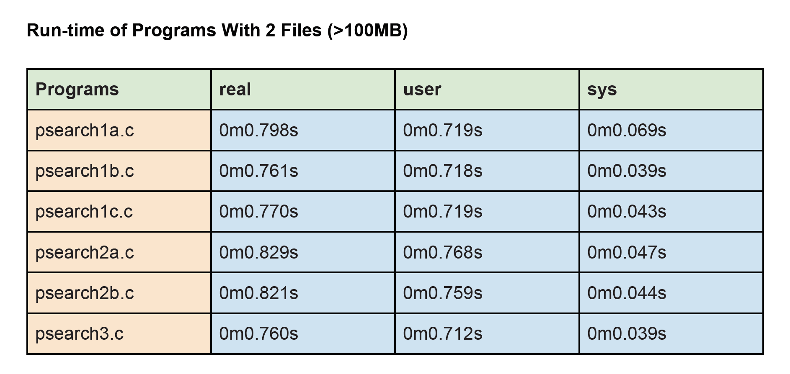

# Search_Word

In this repository, I implement a program that search the spesific word by command line for my Operating System lecture. You can see how to run program in the "project1.docx".

## Gains
Learning process creation and process communication, thread creation and communication, semaphore creation and usage as well as multi-process / multi-threaded application programming. 

When we decrease the file size, obviously program executes in shorter time.

For psearch2b.c with 1 file (45 bytes):
  - real 0m0.013s
  - user 0m0.002s
  - sys 0m0.005s

NOTE: The best one surely threads(see also. psearch3.c), since threads are executed in
parallel.

